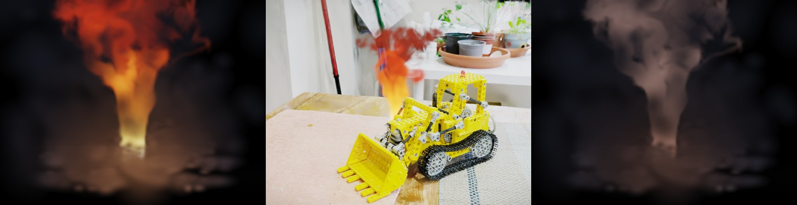

# Vortex Gaussians: Real-Time Simulation-Driven Fire and Smoke as Native Gaussian-Splatting Content

### [[Project Page](https://seanwilliam2077.github.io/VortexGaussians/)] [[Paper (PDF)](static/vortex_gaussians_paper.pdf)] [[Live Demo](https://seanwilliam2077.github.io/VortexGaussians/demo/)] [[Solver Comparison](https://seanwilliam2077.github.io/VortexGaussians/compare.html)] [[Video](static/video/vortex_gaussians_supplemental.mp4)]

Anonymous Author(s)<sup>1</sup>

<sup>1</sup> Anonymous Institution &mdash; author list withheld while the paper is under double-blind review.

[](https://seanwilliam2077.github.io/VortexGaussians/)

*We present the first system that generates fire and smoke by forward physical simulation in real time and renders them as native Gaussian-splatting content. Our key insight is a structural isomorphism: Lagrangian vortex particles and 3D Gaussians are the same class of point primitive, so one particle set serves simultaneously as simulation state and render primitive — position maps to the Gaussian mean, temperature to emissive blackbody color, density to opacity, and velocity gradient to an anisotropic covariance — with no voxelization, meshing, or simulation-to-renderer conversion anywhere. A grid-free Gaussian vortex-particle solver drives them — each splat *is* a Lamb–Oseen vortex element, velocity, its analytic gradient and temperature are closed-form evaluations of the rendered Gaussian mixture under a Barnes–Hut treecode, with no Poisson solve, no linear solve, and no grid anywhere; one depth-sorted emission–absorption rasterizer composites flame, smoke, embers, and reconstructed 3DGS scenes with per-primitive mutual occlusion.*

## News
- **[2026-08]** **We benchmarked our own rasterizer against a reference implementation, found it broken, fixed it — and one of our headline comparisons did not survive the fix.** Every scene-side claim rests on our WebGL2 renderer drawing someone else's reconstruction correctly, so we priced that: the demo in plain unstyled mode against **gsplat 1.5.2** on the identical `.ply` at the identical camera agreed to only **14.97 dB** (MAE 0.1241). Five defects, now fixed, take it to **38.67 dB** (MAE 0.0051). The largest by far was a **missing off-axis clamp before building the perspective Jacobian** — x/z and y/z must be clamped to 1.3·tan(fov/2), or splats outside the frustum get a wildly wrong linearization and smear across the frame; the rest were a near-plane cull at 0.05 instead of Inria's 0.2, no hard screen-space radius cap, 96 depth buckets instead of 1536, and a depth sort keyed on radial eye distance rather than view-space depth. To show this is not circular, `gsplat` is also driven through *our own* `.ply` parser against the **real Mip-NeRF 360 photographs** at the released COLMAP poses: on the uncropped 1.85M-Gaussian release, **32.76 dB / SSIM 0.951** over 21 training views and 29.88 dB / 0.917 over 3 held out, against ~31.5 dB published for this scene — so every convention in the chain is confirmed in an absolute, photo-referenced sense. `colmap_eval.py` ships in the supplemental. Determinism is untouched (vpm 9f6e69db / 4778d741, vic 69ff4c66, bit-identical) and the fire-only frames are byte-identical to the pre-fix build. **The figure camera moved inside the capture.** The old viewpoint sat 3.17 units from the nearest training camera — 14× the 0.22 median inter-camera spacing — with 30.5% of the frame empty and a thin-streak statistic of 0.70‰ against a training-set *maximum* of 0.35‰; those foreground shards are the reconstruction extrapolating, reproducible in the authors' released checkpoint under a reference rasterizer, and no renderer fix removes them. The new camera is training view DSCF0759 raised 0.20 units (streak 0.052‰, 0.001% empty). `kitchen` is re-prepared at a wider crop, where the offline step becomes a **pure filter**: 729,826 of the 1,852,335 Gaussians clear the 0.35 opacity floor inside the box, under the 800k budget, so the seeded subsample discards nothing. **And the honest result: the depth-aware baseline now ties with us.** At the new camera the fire-on/fire-off contribution is ours 100.0%, backdrop **119.3%**, unsorted 112.8%, and the depth-test sweep 99.9/100.1/100.4/101.4/110.2% at α = 0.15…0.90 — ours and α=0.50 differ in 3,133 of 1,372,000 pixels. The reason is the occluder: the model loader's lift arms are opaque plastic, so over the flame's silhouette 85.5% is fully transmitted and 12.0% fully blocked with only 2.5% partial, and binary occlusion is exactly what a z-test resolves correctly. The comparison against the prior art survives intact — the backdrop composite is FieryGS's actual model, and it puts the flame's white-hot base in front of arms that should hide it — but the *stronger baseline we invented ourselves* is no longer beaten, and the paper now says so and marks it an evaluation gap. Closing it needs a genuinely semi-transparent occluder, which this reconstruction cannot supply from any in-distribution viewpoint. **Costs re-measured, and the earlier correction was itself wrong.** Paired in one session at 1280×800 with the procedural environment splats off throughout: fire alone 19.7 ms (51 FPS), +45.8k synthetic 36.4 ms, +380k campsite 160.9 ms, +729,826 `kitchen` 292.4 ms (3.4 FPS); the simulation step never moves, so the whole deficit is rasterization. Subtracting the fire's own 5.0 ms draw, the marginal cost per scene Gaussian is **flat to within 3%** across one and a half orders of magnitude (365/375/373 ns) — the previous claim that it drifts up, and the "extrapolation understates by 15%" that came with it, are withdrawn. The interleave premium is now measured at both scene sizes (+8% at 45.8k, +22% at 729,826; 38 vs 71 ns per scene splat) and traced to the per-splat scatter copy rather than the bucket count, which a K = 96/384/1536/4096 sweep shows costs only 0.19 ms. Two benchmark defects fell out: `gather()` read a camera matrix that `benchcfg` populates only inside `render()`, crashing every bench call in a hidden tab, and Table 4 had been measured with the 640 environment splats off while the prose quoted them on.
- **[2026-08]** **Side-by-side solver comparison shipped, and the demo panel was redesigned around it.** The panel now leads with the solver choice -- **Grid Mode (VIC)** vs **Grid-Free (Gaussian VPM)** -- with the advanced parameters folded away; [`compare.html`](https://seanwilliam2077.github.io/VortexGaussians/compare.html) runs both solvers in lockstep from one seed, timestep and control stream, with per-side solver cost measured live. The supplemental video was re-cut around the same idea: three same-seed side-by-side sequences (fixed / orbit / scripted interaction) plus the fire-spread finale, 65 s at 1080p. Numbers quoted in earlier entries were superseded by the canonical five-seed Chrome re-measurement that the paper now uses throughout (grid-free premium 2.3x at the quality preset, 1.3x at the interactive preset; treecode up to 15.3x faster than the exact sum at matched particle counts; four-seed spectral means with grid-refinement, core-radius and timestep controls).
- **[2026-08]** **Full experiment redo on the grid-free solver — the headline numbers changed, in our favor.** In-plane spectra vs. a matched 3D Boussinesq reference: the grid-free stack holds 52-60% largest-bin energy (VIC-era stack: 83-92%; reference: 48%) with 20-26% mid-band -- the mid-band rolling the grid's Nyquist suppressed is actually simulated now. The particle-strength-exchange inter-slice operator raises adjacent-slice coherence 0.20 -> 0.68 (0.77 with coarse coupling; 3D control: 0.80) where its grid form had measured an inconclusive 0.13-0.19. New matched 3D baseline is a 3D Gaussian VPM (vector vortons, erf-form kernel, analytic stretching): 2.8x the stack's sim step at matched budget; ablating stretching moves its spectrum by only 0.06 -- under the grid-free pair the layered gap is mostly three-component transport, not the stretching cascade (the attribution is discretization-dependent). Treecode vs exact Biot-Savart: no crossover anywhere (faster from Np=150 up; 7.8x at 2400). All paper figures re-shot seed-pinned through the revived capture harness (`Research/capture-harness/`).
- **[2026-08]** **The solver is now grid-free — "Gaussian-native" holds on the simulation side too.** Route 2's default solver is a Gaussian vortex-particle method: each splat is a Lamb–Oseen vortex element; velocity, its analytic gradient (feeding the rendered covariance) and the Shepard-mixture temperature (moment-renormalized SPH gradient for the baroclinic source) are closed-form evaluations of the rendered mixture, accelerated by a Barnes–Hut treecode over moment-matched super-Gaussians whose merged top levels + ground mirror vortices replace the coarse grid solver as the directable field. No Poisson, no grid, no linear solve. The VIC solver is retained as a toggleable baseline; the exact O(N²) Biot–Savart sum is retained as the treecode's error reference (~1.5% rel. L2 at θ=0.7). Grid freedom costs ~3.5× the VIC sim step at matched counts (still real-time end to end).
- **[2026-08]** Added the baseline the paper was missing: a **true 3D vortex-in-cell solver inside the demo** (`3D VIC (baseline)` in the dimension segment), sharing the world domain, in-plane resolution, Jacobi count, particle scheme, source terms, timestep, particle-to-Gaussian mapping and renderer with the slice stack. At matched cell count it runs at **1.81x** the layered simulation step (sort and render unchanged). Ablating vortex stretching inside it accounts for **70%** of the in-plane spectral gap to the stack, turning the paper's attribution from an argument into a measurement. `P.stretch3=0` toggles the ablation.

- **[2026-08]** Corrected the scene footprint to the Gaussian the file declares (`exp(-2.42 r^2)` against a 2.2-sigma quad half-axis, was `exp(-4.0 r^2)` with a hard discard step), so flame, smoke, embers and scene now share one footprint; stopped clamping DC colour to 1 before the HDR chain. Occlusion comparison now uses a **fair baseline** — scene sorted correctly among itself, only the two-stream interleave removed — instead of a strawman that also destroyed the scene's own ordering. Re-ran the E(k) measurement at 4.3x particle density: the spectral gap does not close, so it is not a sampling artifact. Demo UI is fully in English.
- **[2026-08]** Supplemental video (95 s, six single-take sequences including the fast-azimuth **failure case**, shown not cut around). Frames rendered deterministically at Δt=1/60 s and encoded at 60 fps so playback speed equals simulation speed; the on-screen counter is the live-measured rate (18.4 ms / 54 FPS) on the same machine. Paper now carries **zero TODO markers** — remaining gaps are stated as prose in a "what this evaluation does not yet cover" paragraph.
- **[2026-07]** Rendering + claims overhaul after an adversarial review pass: fire fragments now carry a true Gaussian footprint (previously `exp(-3r²)` was only a discard mask, so fire splats had constant alpha and visible quad corners), a single footprint constant is shared by flame/smoke/embers/scene, and the pedestal is subtracted so alpha reaches exactly zero at the quad edge. Default particle budget raised to 1300/layer (12.4k Gaussians, 17.8 ms / 56 FPS on an RTX 3080 at 1280×800). All figures re-shot; overstated claims (pressure-free advection, inter-slice operator, saturated brightness metric, cross-system timing) corrected or withdrawn.

- **[2026-07]** Splat-graph fire spread: combustion state (heat/fuel/char/glow) now lives directly on the loaded scene's splats — the simulated flame ignites the reconstruction, fire spreads with conventional heat-threshold physics (Pirk 2017, Hädrich 2021 lineage), charring writes into splat albedo/opacity, and burning geometry re-seeds the solver with new plumes (bidirectional sim↔scene loop: the plume above the fire is sustained by the burning scene, not only by the original emitter). `P.spreadOn` + `__demo.ignite(x,y,z,r)`.
- **[2026-07]** E(k) spectral validation landed: the layered approximation is now measured against a matched true-3D Boussinesq reference (same domain/source/Δt, solver in `supplemental/ref3d.py`) — the stack concentrates 83–92% of in-plane energy in the largest-scale bin vs 48% for 3D (the predicted missing-vortex-stretching signature), coupling narrows the spectral distance only modestly, and adjacent-plane coherence is 0.13–0.19 vs 0.93 in 3D. The paper's honesty section is now quantitative (new Fig. "spectral comparison").
- **[2026-07]** Deterministic replay + measured benchmarks: all stochastic paths draw from one seeded PRNG, runs are bit-reproducible from `(seed, steps)` (FNV-1a state hash), and the paper now ships a measured scaling table — linear in slice count, VIC ~3.4× faster than naive Biot–Savart at the default budget (RTX 3080, CPU-JS sim).
- **[2026-07]** Inter-slice vorticity-coupling operator (`interZ`) added: bidirectional, circulation-conserving z-Laplacian exchange across slices, filling a hole in layered fire (which has no slice-to-slice communication). Scoped honestly: it is the standard three-point stencil, carries no 1/Δz², is off by default, and its controlled probe was inconclusive — it is described in the method, not claimed as a contribution.
- **[2026-07]** Loaded `.ply` reconstructions are now merged into the global depth order by an asymmetric exact/bucketed two-stream interleave — foreground scene objects correctly occlude the flame, at no measured overhead.
- **[2026-07]** Initial release: paper draft, project page, and the single-file WebGL2 real-time prototype.

## Cloning the Repository

```shell
git clone https://github.com/Seanwilliam2077/VortexGaussians.git
```

## Quick Start

The entire system — simulation, sorting, rendering, UI — is one dependency-free HTML file. **No installation, no GPU compute, no build step.**

```shell
# option 1: just open it
demo/index.html          # double-click; any WebGL2 browser (Chrome / Edge / Firefox)

# option 2: serve locally (needed only if your browser blocks file:// workers)
python -m http.server 8000
# then open http://localhost:8000/demo/
```

Interactive default: N=9 × 600 particles/layer at treecode θ=0.9 — ~60 FPS on a desktop RTX 3080 at 1280×800, simulation single-threaded in CPU JavaScript (grid-free VPM sim ~10 ms/step). Quality/benchmark preset: 1300/layer at θ=0.7 (set via `__demo.bench` or the console); the paper's full benchmark matrix uses a canonical five-seed Chrome re-measurement — 58 FPS / 17.1 ms per frame end-to-end at the shipping preset, grid-free premium 2.3× at the quality preset and 1.3× at the interactive preset, treecode up to 15.3× faster than the exact sum at matched particle counts. Deterministic replay: `window.__demo.reset(seed)` + `.step(n)` + `.hash()` reproduce any run bit-exactly.

### Solver comparison

The demo panel's top section chooses the solver: **Grid Mode** (the retained VIC baseline, one
32x48 velocity grid per slice) or **Grid-Free** (the Gaussian VPM). For a direct A/B,
[`compare.html`](https://seanwilliam2077.github.io/VortexGaussians/compare.html) runs both side by
side in lockstep -- same seed, same fixed timestep, same renderer and control stream; the only
difference is the solver. Per-side solver cost is measured live on your machine.

### Interactive controls

| Control | Effect |
| --- | --- |
| **drag canvas** | orbit the 3D camera (auto-orbit resumes on release) |
| **Shift + drag** | move the fire source; the plume follows with vortical lag |
| **`1` / `2` / `3`** | all layers procedural / VIC baseline / grid-free Gaussian VPM (hot-swap, same renderer) |
| **`F` / `S`** | fire / smoke shading of the same particle state |
| **`Space` / `R`** | pause / reset |
| **`Sim Layers` slider** | per-layer solver hot-swap (0 … N) |
| **`View-aligned / World-fixed`** | slice-orientation ablation (edge-on collapse of world-fixed) |
| **panel sliders** | buoyancy, baroclinic gain β, cooling, coupling c, inter-slice κz, covariance gain, exposure/bloom, … |

### Key simulation parameters

- `layers` (N = 9) × `ppl` (600 interactive / 1300 quality): view-aligned slices × particles each; every slice runs an independent grid-free Gaussian vortex-particle solve (a 32×48 vortex-in-cell baseline is retained for A/B, `Solver` toggle; keys `2`/`3` switch).
- `couple` (c = 0.5): velocity nudge toward the 16×24 coarse global solver — 0 = independent slices, 1 = slaved to bulk motion.
- `interZ` (κz = 0, off by default): inter-slice vorticity exchange `ω_k += Δt·κz·(ω_{k−1}+ω_{k+1}−2ω_k)`; conserves total circulation. Exchange rate, not a diffusivity (no 1/Δz²), so not comparable across slice counts.
- `baro` (β = 1.4): baroclinic source Γ̇ = β·∂T/∂x — the temperature → buoyancy → vorticity loop that rolls plume edges.
- `covStretch` (1.3): flow-driven covariance Σ̇ = LΣ + ΣLᵀ with determinant renormalization and aspect clamp.

## Custom Scenes

Load your own Gaussian-splatting reconstruction and light a fire inside it:

1. Train a scene with [Inria 3DGS](https://github.com/graphdeco-inria/gaussian-splatting) (or use any binary little-endian `.ply` in its format). To try it immediately, use the campfire scene from the paper: [`static/test_scene.ply`](static/test_scene.ply) (45,808 splats).
2. In the demo panel, open **Scene** and load the `.ply` (subsampled to a configurable budget, default 120k splats).
3. The scene is merged into the same global depth order as the fire — foreground geometry occludes the flame per primitive (`sceneSorted` toggles the naive draw-after baseline for comparison).
4. Adjust `sceneScale` / `sceneYaw` / `sceneLift` to place the fire where you want it.

## Repository Structure

```
index.html        # project page (self-contained; occlusion comparison slider, embedded demo)
demo/index.html   # the complete system: single-file WebGL2 prototype (~160 KB, 57 KB gzipped)
static/           # paper PDF, compressed figures, supplemental video, sample .ply scene
PUBLISH.md        # page-deployment checklist (GitHub Pages)
```

## TODO

- [x] Supplemental video (95 s: real-time, orbit, failure case, interaction, coupling sweep, fire spread)
- [x] Named-hardware benchmark table (FPS vs. layers / particles) + deterministic replay
- [ ] Second hardware point (consumer laptop iGPU)
- [x] Energy-spectrum E(k) validation against a true-3D reference solve (negative-leaning result, reported honestly)
- [ ] Occlusion + fire-spread figures on a real captured `.ply` reconstruction
- [x] Multi-source in-scene ignition (delivered by the fire-spread loop: burning splats feed multiple slices concurrently)

## Citation

```bibtex
@misc{vortexgaussians2026,
  title  = {Vortex Gaussians: Real-Time Simulation-Driven Fire and Smoke
            as Native Gaussian-Splatting Content},
  author = {Anonymous Author(s)},
  year   = {2026},
  note   = {Preprint, under review}
}
```

## Acknowledgements

The layered two-level architecture builds on Horvath & Geiger's production fire system (SIGGRAPH 2009); the rasterizer implements the forward pass of [3D Gaussian Splatting](https://repo-sam.inria.fr/fungraph/3d-gaussian-splatting/) (Kerbl et al. 2023). The project page adapts the layout of [Nerfies](https://nerfies.github.io/) and [FieryGS](https://pku-vcl-geometry.github.io/FieryGS/); the README follows the format of [PhysGaussian](https://github.com/XPandora/PhysGaussian).
